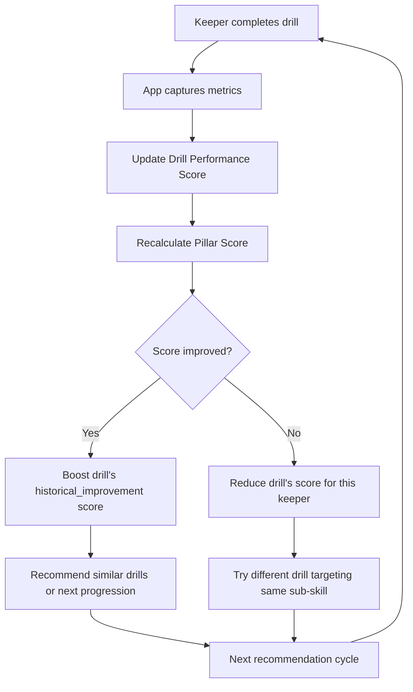

# Drill Recommendation Engine
### Weakness → Drill Logic for Goalie Coach App

---

## Overview

The recommendation engine identifies a keeper's **weakest skill areas** and surfaces the most effective drills to address them. It operates across three layers:

```
┌────────────────────────────────────────────────────┐
│  LAYER 1: WEAKNESS DETECTION                       │
│  Analyze scores across skill pillars               │
├────────────────────────────────────────────────────┤
│  LAYER 2: DRILL SELECTION                          │
│  Match weakness to drills, filter by context       │
├────────────────────────────────────────────────────┤
│  LAYER 3: PRESENTATION & SCHEDULING               │
│  Prioritize, package, and schedule recommendations │
└────────────────────────────────────────────────────┘
```

---

## Layer 1: Weakness Detection

### Data Sources

| Source | Data Collected | Refresh Frequency |
|---|---|---|
| **Match Reports** | Save %, cross claiming rate, distribution accuracy, decision quality ratings, errors | After every match |
| **Drill Sessions** | Success rate per drill, technique quality ratings (1–5), rep counts | After every session |
| **Coach Evaluations** | Subjective ratings (1–5) per pillar, text notes | After every session/match |
| **Self-Assessment** | Keeper's own ratings (1–5) per pillar | After every session/match |
| **Physical Benchmarks** | T-test time, vertical jump, agility scores | Monthly |

### Scoring Model

Each of the **8 skill pillars** gets a composite score from 0–100:

```
Pillar Score = (
    Match Performance Score  × 0.40
  + Drill Performance Score  × 0.25
  + Coach Evaluation Score   × 0.25
  + Self-Assessment Score    × 0.10
)
```

**Match Performance Score (0–100):**
- Derived from contextual stats (save %, cross claim rate, distribution accuracy, etc.)
- Normalized against age-group benchmarks (not peer comparison — benchmark expectations)

**Drill Performance Score (0–100):**
- Rolling average of success rates and quality ratings across the last 10 sessions
- Weighted toward recent sessions (exponential decay: most recent = 1.0, 5 sessions ago = 0.5)

**Coach Evaluation Score (0–100):**
- Average of coach's 1–5 ratings, scaled to 0–100

**Self-Assessment Score (0–100):**
- Average of keeper's 1–5 ratings, scaled to 0–100

### Weakness Threshold Logic

```
IF pillar_score < age_group_benchmark - 15:
    flag = "PRIORITY WEAKNESS"     → Red zone
    recommendation_urgency = HIGH

ELIF pillar_score < age_group_benchmark - 5:
    flag = "DEVELOPMENT AREA"      → Yellow zone
    recommendation_urgency = MEDIUM

ELIF pillar_score < age_group_benchmark:
    flag = "ON TRACK"              → Green zone
    recommendation_urgency = LOW

ELSE:
    flag = "STRENGTH"              → Blue zone
    recommendation_urgency = NONE (maintain)
```

### Age-Group Benchmarks (Illustrative — calibrate with real data)

| Pillar | U8–U10 | U11–U13 | U14–U16 | U17–U18 |
|---|---|---|---|---|
| Shot Stopping | 50 | 55 | 65 | 75 |
| Crosses & High Balls | N/A | 45 | 60 | 70 |
| 1v1 & Breakaways | N/A | 45 | 55 | 65 |
| Distribution | 45 | 50 | 60 | 70 |
| Footwork & Agility | 50 | 55 | 65 | 75 |
| Tactical Awareness | 40 | 50 | 60 | 70 |
| Communication | 35 | 45 | 55 | 65 |
| Mental & Psychological | 40 | 50 | 55 | 65 |

> [!IMPORTANT]
> Benchmarks are NOT peer rankings. They represent "age-appropriate developmental expectations." A U12 at 45 in Shot Stopping is developing normally. The app should communicate this clearly: "Right where you should be" or "Room to grow" — never "below average."

---

## Layer 2: Drill Selection

### Drill Metadata Schema

Every drill in the library has the following tags:

```json
{
  "drill_id": "SS-U11-02",
  "name": "Collapse Dive Progression",
  "pillar": "shot_stopping",
  "sub_skills": ["diving_technique", "safe_landing", "hand_position"],
  "age_groups": ["U11-U13"],
  "type": "partner",
  "solo_at_home": false,
  "equipment": ["ball", "crash_mat_optional"],
  "duration_minutes": 15,
  "intensity": "medium",
  "reps": 24,
  "has_video_demo": true,
  "difficulty": 2,
  "prerequisite_drills": ["SS-U8-01"],
  "progression_drills": ["SS-U14-02"],
  "fatigue_impact": "medium",
  "assessment_metrics": ["landing_sequence", "hand_position", "technique_quality"]
}
```

### Selection Algorithm

```
FUNCTION recommend_drills(keeper):

  // Step 1: Get weakness areas sorted by urgency
  weaknesses = get_weaknesses(keeper)
  weaknesses.sort_by(urgency, descending)

  // Step 2: For each weakness, find matching drills
  recommendations = []
  FOR EACH weakness IN weaknesses:

    candidate_drills = drills.filter(
      pillar == weakness.pillar
      AND age_group INCLUDES keeper.age_group
      AND difficulty <= keeper.current_level + 1
      AND prerequisite_drills ALL completed
    )

    // Step 3: Score each candidate drill
    FOR EACH drill IN candidate_drills:
      drill.score = calculate_drill_score(drill, keeper, weakness)

    // Step 4: Pick top drills
    top_drills = candidate_drills.sort_by(score, descending).take(3)
    recommendations.append({
      weakness: weakness,
      drills: top_drills
    })

  // Step 5: Ensure at least 1 at-home drill in final list
  IF recommendations.none(drill.solo_at_home == true):
    swap_lowest_scored_drill_with_best_at_home_option()

  // Step 6: Check training load
  IF keeper.weekly_sessions >= max_sessions_for_age_group:
    filter_to_at_home_and_low_intensity_only()

  RETURN recommendations
```

### Drill Scoring Function

```
FUNCTION calculate_drill_score(drill, keeper, weakness):

  base_score = 50

  // Sub-skill match bonus: if the drill targets the specific
  // sub-skill that is weakest within the pillar
  sub_skill_match = overlap(drill.sub_skills, weakness.weakest_sub_skills)
  base_score += sub_skill_match * 15        // up to +45

  // Freshness penalty: avoid recommending the same drill repeatedly
  days_since_last_done = drill.last_completed_by(keeper)
  IF days_since_last_done < 3:
    base_score -= 20                         // too recent
  ELIF days_since_last_done < 7:
    base_score -= 5                          // slightly recent
  // > 7 days: no penalty

  // Difficulty sweet spot: drills at or slightly above
  // current level are best for growth
  difficulty_gap = drill.difficulty - keeper.pillar_level(weakness.pillar)
  IF difficulty_gap == 0:
    base_score += 10                         // at level
  ELIF difficulty_gap == 1:
    base_score += 15                         // stretch zone (ideal)
  ELIF difficulty_gap == -1:
    base_score += 5                          // slightly easy (consolidation)
  ELIF difficulty_gap >= 2:
    base_score -= 20                         // too hard
  ELIF difficulty_gap <= -2:
    base_score -= 15                         // too easy

  // Historical success: if the keeper improves after this drill,
  // boost it (reinforcement learning signal)
  improvement_after = drill.historical_improvement_for(keeper)
  base_score += improvement_after * 10       // up to +20

  // At-home bonus when no upcoming team session
  IF keeper.next_team_session > 3 days AND drill.solo_at_home:
    base_score += 10

  // Fatigue consideration
  IF keeper.sessions_this_week >= 3 AND drill.intensity == "high":
    base_score -= 15

  RETURN base_score
```

---

## Layer 3: Presentation & Scheduling

### Recommendation Card (In-App UI)

```
╔══════════════════════════════════════════════════════╗
║  📍 DEVELOPMENT AREA: Shot Stopping — Diving        ║
║                                                      ║
║  Your diving technique score has dropped 8 points    ║
║  over the last 3 sessions. Let's fix that.           ║
║                                                      ║
║  ┌──────────────────────────────────────────────┐    ║
║  │ 🏠 RECOMMENDED: Collapse Dive Progression    │    ║
║  │ ⏱ 15 min  |  📦 Ball + mat  | ⭐ 3/5 diff  │    ║
║  │                                              │    ║
║  │ Focus on landing sequence: thigh → hip → rib │    ║
║  │                                              │    ║
║  │  [▶ Watch Demo]     [✅ Start Drill]         │    ║
║  └──────────────────────────────────────────────┘    ║
║                                                      ║
║  Also recommended:                                   ║
║  • Extension Dive Series (👥 partner needed)         ║
║  • Shadow Diving Visualization (🏠 at home)          ║
║                                                      ║
╚══════════════════════════════════════════════════════╝
```

### Weekly Session Planner Logic

```
FUNCTION generate_weekly_plan(keeper):

  // Determine sessions available this week
  available_sessions = keeper.scheduled_sessions_this_week
  at_home_days = 7 - available_sessions.count

  plan = []

  // Team sessions: focus on partner/coach drills for top 2 weaknesses
  FOR EACH session IN available_sessions:
    top_weakness = keeper.weaknesses[0]  // rotate through top weaknesses
    plan.add({
      day: session.day,
      type: "team",
      warm_up: get_warm_up_for(top_weakness.pillar),
      main_drill: recommend_drills(keeper)[0].drills[0],  // top scored
      secondary_drill: recommend_drills(keeper)[0].drills[1],
      cool_down: "standard_gk_cooldown"
    })

  // At-home sessions: 2–3 per week max, at-home drills only
  home_sessions_target = min(3, at_home_days)
  home_drills = recommend_drills(keeper).filter(solo_at_home == true)

  FOR i IN range(home_sessions_target):
    plan.add({
      day: suggest_rest_day_offset(available_sessions, i),
      type: "at_home",
      drill: home_drills[i],
      duration: "15–20 min",
      note: "Film yourself and review against the demo video"
    })

  // Rest days: at least 1 per week, 2 for U8–U13
  enforce_rest_days(plan, keeper.age_group)

  RETURN plan
```

### Sample Weekly Plan Output

```
╔════════════════════════════════════════════════════════╗
║  📅 WEEKLY PLAN — Sarah M. (U14)                     ║
║  Focus Areas: Diving Technique, Distribution          ║
╠════════════════════════════════════════════════════════╣
║  MON  🏠  Collapse Dive Progression (15 min)          ║
║           + The Reset Routine mental drill (5 min)    ║
║                                                       ║
║  TUE  ⚽  Team Training                               ║
║           Warm-up: Box Agility Circuit                ║
║           Main: Extension Dive Series                 ║
║           Secondary: Counter-Attack Throw             ║
║                                                       ║
║  WED  😴  Rest Day                                    ║
║                                                       ║
║  THU  🏠  Driven Pass Against Wall (20 min)           ║
║           + Mirror Commands (5 min)                   ║
║                                                       ║
║  FRI  ⚽  Team Training                               ║
║           Warm-up: T-Test Speed Drill                 ║
║           Main: Build From Back Under Press           ║
║           Secondary: Deflection & Second Ball         ║
║                                                       ║
║  SAT  ⚽  MATCH DAY                                   ║
║           Pre-match: Visualization Routine (10 min)   ║
║           Post-match: Match Report + Self-Assessment  ║
║                                                       ║
║  SUN  😴  Rest Day                                    ║
║           Optional: Journaling & Reflection (10 min)  ║
╚════════════════════════════════════════════════════════╝
```

---

## Feedback Loop: How Recommendations Get Smarter



### Progression Logic

When a keeper masters a drill (consistently scoring 4+ technique quality over 5 sessions):

```
FUNCTION check_progression(keeper, drill):

  recent_scores = drill.get_last_n_scores(keeper, 5)

  IF recent_scores.average >= 4.0 AND recent_scores.min >= 3.0:
    // Mastered! Move to the next progression
    next_drill = drill.progression_drills[0]

    IF next_drill.age_group INCLUDES keeper.age_group:
      recommend(next_drill)
      award_milestone("Mastered: " + drill.name)
    ELSE:
      // Next drill is for older age group — keep refining
      increase_drill_difficulty_variant(drill)
      // E.g., closer to wall, faster reps, add pressure

  ELIF recent_scores.average < 2.5:
    // Struggling — step back to prerequisite
    prereq_drill = drill.prerequisite_drills[0]
    recommend(prereq_drill)
    show_message("Let's strengthen the foundation first")
```

---

## Edge Cases & Special Rules

### Rule 1: Never Overload a Single Pillar
```
IF weekly_plan has > 60% drills from same pillar:
    swap one drill for the next-priority weakness pillar
    // Keeps development balanced
```

### Rule 2: Match-Day Awareness
```
IF match_in_next_24_hours:
    recommend only LOW INTENSITY drills
    prioritize MENTAL drills (visualization, reset routine)
    suppress any new technique drills (avoid confusion before a match)
```

### Rule 3: Post-Error Sensitivity
```
IF keeper.last_match had error_leading_to_goal:
    DO NOT immediately recommend drills for that error's pillar
    WAIT 48 hours (let the emotional sting pass)
    THEN surface a drill with encouraging framing:
        "Everyone makes mistakes. Here's a drill to
         build even more confidence in [area]."
```

### Rule 4: Injury / Pain Awareness
```
IF keeper.body_map has active pain in [wrist/shoulder/knee/hip]:
    EXCLUDE drills that stress that body part
    RECOMMEND recovery-compatible drills (mental, tactical film study, communication)
    SHOW message: "We're protecting your [body part] today. Focus on the mental game."
```

### Rule 5: Engagement Drop Detection
```
IF keeper.completed_drills_this_week < usual_average * 0.5:
    // Engagement is dropping
    surface FUN drills (reaction ball, challenges with point scoring)
    reduce recommended volume
    send encouraging notification:
        "Just 10 minutes today? Try the Reaction Ball Wall Drill — it's a blast."
```

### Rule 6: Strength Maintenance
```
IF pillar_score > age_group_benchmark + 10:
    // This is a strength — don't neglect it
    recommend 1 maintenance drill per week for this pillar
    focus effort on weaker areas
```

---

## Recommendation Frequency Summary

| Keeper Activity | Recommendation Trigger |
|---|---|
| Opens app | Show "Today's Recommended Drill" card |
| Completes a match | Generate post-match recommendations (48hr delay for errors) |
| Completes a drill session | Update scores, refresh weekly plan |
| Weekly (Sunday) | Auto-generate new weekly plan based on latest data |
| Monthly | Comprehensive progress review with updated benchmarks |
| Coach session | Coach sees recommended focus areas and drill suggestions for that keeper |
